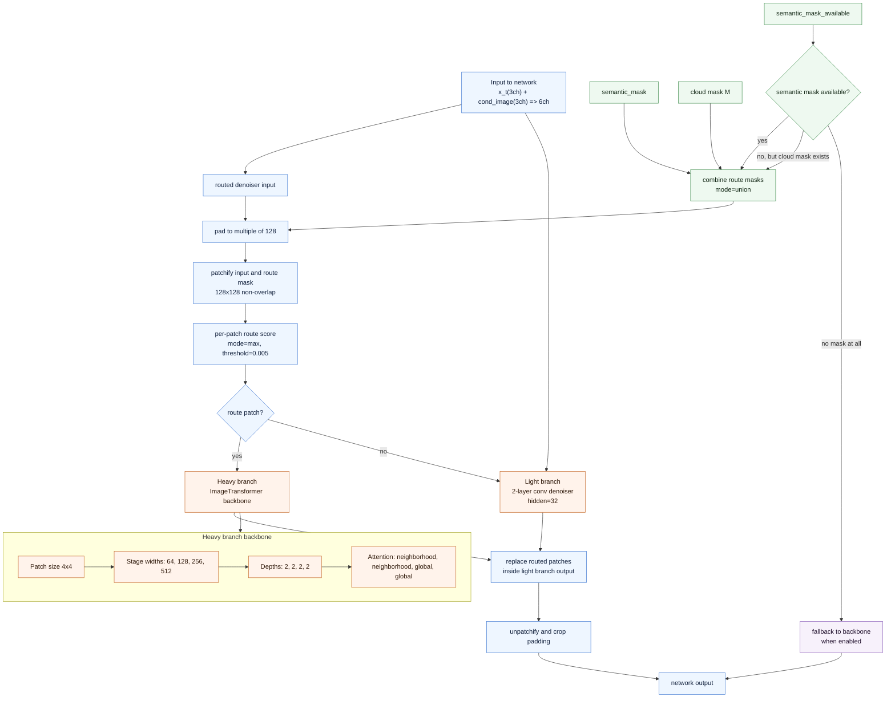

# Semantic Routed Cloud Removal Framework

Source config:
`configs/example_training/patch_synthetic_clouds_semantic_routed.yaml`

Primary implementation files:
`sgm/models/diffusion.py`
`sgm/data/base.py`
`sgm/data/patches/cloud_patch_dataset.py`
`sgm/modules/diffusionmodules/wrappers.py`
`sgm/modules/diffusionmodules/denoiser.py`
`sgm/modules/diffusionmodules/semantic_routed_denoiser.py`
`sgm/modules/diffusionmodules/importance_loss.py`
`sgm/modules/diffusionmodules/semantic_feature_matching.py`

## 1. End-to-end framework

```mermaid
flowchart LR
    CFG["YAML config<br/>semantic routed experiment"] --> DM["DataModuleFromConfig<br/>batch_size=1, workers=8"]
    CFG --> ENG["ResidualDiffusionEngine"]
    CFG --> CB["Lightning callbacks<br/>checkpoint + image logger"]

    subgraph DATA["Dataset and batch construction"]
        DS["CloudRemovalPatchDataset<br/>root=datasets/archive_random_10pct_experiment_crops_heavy_cloud"]
        CIMG["cond_image<br/>cloudy input / mu"]
        TGT["label<br/>clear target"]
        CMASK["M<br/>cloud mask"]
        SMASK["semantic_mask"]
        SAVAIL["semantic_mask_available"]
        IPATH["image_path"]
        DS --> CIMG
        DS --> TGT
        DS --> CMASK
        DS --> SMASK
        DS --> SAVAIL
        DS --> IPATH
    end

    DM --> DS
    ENG --> LOSS
    ENG --> SAM

    subgraph TRAIN["Training path"]
        FS1["IdentityFirstStage<br/>encode target"]
        FS2["IdentityFirstStage<br/>encode cond_image"]
        COND["GeneralConditioner<br/>IdentityEmbedder(cond_image)"]
        SIG["EDMSigma2St<br/>alpha=3.0"]
        LOSS["SemanticFeatureMatchingResidualDiffusionLoss"]
        WPIX["Importance-aware pixel loss<br/>mask_key=M, importance_weight=4.0"]
        VGG["MaskWeightedAsymmetricFeatureMatchingLoss<br/>VGG relu2_2, relu3_3, relu4_3"]
        DENO["ResidualDenoiser<br/>ResidualEDMScaling"]
        WRAP["CloudRemovalWrapper<br/>concat(x_t, cond_image)"]
        NET["SemanticRoutedPatchDenoiser"]
        PRED["predicted residual / denoised output"]
        LOGS["EMA, metrics, image logging"]

        TGT --> FS1
        CIMG --> FS2
        CIMG --> COND
        FS1 --> ZX["z_x"]
        FS2 --> ZMU["z_mu"]
        ZX --> LOSS
        ZMU --> LOSS
        SIG --> LOSS
        SMASK --> LOSS
        SAVAIL --> LOSS
        CMASK --> LOSS
        LOSS --> XT["build x_t<br/>noise(z_x, z_mu, sigma, st)"]
        XT --> DENO
        COND --> DENO
        SMASK --> DENO
        SAVAIL --> DENO
        CMASK --> DENO
        DENO --> WRAP
        WRAP --> NET
        NET --> PRED
        PRED --> WPIX
        ZX --> WPIX
        CMASK --> WPIX
        PRED --> VGG
        ZX --> VGG
        SMASK --> VGG
        SAVAIL --> VGG
        CMASK --> VGG
        WPIX --> LTOTAL["total loss"]
        VGG --> LTOTAL
        LTOTAL --> LOGS
    end

    subgraph INFER["Sampling / validation / prediction path"]
        SCOND["Conditioning from cond_image"]
        SKW["sampling kwargs<br/>semantic_mask, semantic_mask_available, M"]
        SAM["ResidualHeunEDMSampler<br/>8 reverse steps"]
        LOOP["repeated ResidualDenoiser calls"]
        DEC["IdentityFirstStage decode"]
        OUT["restored image"]
        EVAL["image metrics / save outputs"]

        CIMG --> SCOND
        CIMG --> ZMU2["z_mu"]
        SMASK --> SKW
        SAVAIL --> SKW
        CMASK --> SKW
        SCOND --> SAM
        ZMU2 --> SAM
        SKW --> SAM
        SAM --> LOOP
        LOOP --> DENO
        DENO --> WRAP
        WRAP --> NET
        NET --> DEC
        DEC --> OUT
        OUT --> EVAL
    end

    classDef cfg fill:#f7f3e8,stroke:#8c6d3b,color:#1f1a12,stroke-width:1px;
    classDef data fill:#edf7f4,stroke:#2f7f6f,color:#10201c,stroke-width:1px;
    classDef core fill:#eef2fb,stroke:#4b61c9,color:#10162c,stroke-width:1px;
    classDef loss fill:#fff1ee,stroke:#c75b39,color:#2d120b,stroke-width:1px;
    classDef io fill:#f5f5f5,stroke:#777,color:#222,stroke-width:1px;

    class CFG,CB cfg;
    class DM,DS,CIMG,TGT,CMASK,SMASK,SAVAIL,IPATH data;
    class ENG,FS1,FS2,COND,SIG,DENO,WRAP,NET,SAM,LOOP,DEC,SCOND,SKW,XT,ZX,ZMU,ZMU2,PRED,OUT,LOGS core;
    class LOSS,WPIX,VGG,LTOTAL,EVAL loss;
```

## 2. Internal routing logic of `SemanticRoutedPatchDenoiser`

## 3. Design summary

- `cond_image` is used twice: once as `mean_key` (`z_mu`) for residual diffusion, and once as conditioner input for concat conditioning.
- The wrapper concatenates noisy latent and conditional image before the routed denoiser sees them, so the routed network always works on 6-channel input.
- Routing is driven by semantic mask, cloud mask, or their union. That means expensive transformer inference is focused on semantically important or cloud-corrupted patches.
- Background patches are handled by the lightweight branch, reducing compute while keeping a full-image output tensor.
- Training supervision is dual-path: pixel reconstruction is cloud-aware and mask-weighted, while VGG feature matching is semantic-aware and asymmetric between foreground and background.
- During sampling, the same routed denoiser is reused at every reverse diffusion step, and the mask tensors are forwarded as sampling kwargs so routing behavior stays consistent with training.
